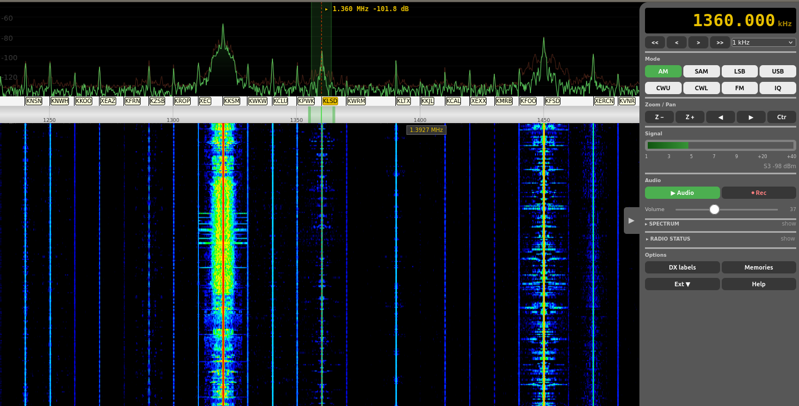

# Radio Zuzu

> **Status — In transition.** Radio Zuzu is being rebuilt as a
> self-contained Python web app on top of upstream
> [ka9q-radio](https://github.com/ka9q/ka9q-radio) and
> [ka9q-python](https://github.com/mijahauan/ka9q-python). The previous
> ka9q-web C server and JavaScript overlay have been moved into
> [`legacy/`](legacy/) and are no longer the development target.
>
> The full plan, phases, and gating questions live in
> [`docs/MODERNIZATION.md`](docs/MODERNIZATION.md). Non-functional during
> the transition; check back in early June 2026.



## Where things are

| Path | What it is |
|---|---|
| [`docs/MODERNIZATION.md`](docs/MODERNIZATION.md) | The transition plan — server stack, frontend, audio path, ka9q-python tasks, risks. |
| [`docs/`](docs/) | Design, ops, and historical notes (overlay improvements, touch gestures, dev test guide, open issues). |
| [`config/`](config/) | `radiod` configuration (`radiod@rx888-web.conf`). Shared with both legacy and new builds. |
| `ka9q-radio/` | Submodule, tracking upstream `main`. |
| `server/` *(coming Phase 1)* | New FastAPI app that bridges the browser to `radiod` via `ka9q-python`. |
| `web/` *(coming Phase 1)* | Plain-JS frontend, promoted from the palomar overlay. |
| [`legacy/`](legacy/) | The previous ka9q-web C server, the original `radio.html` / `radio.js`, the Flask admin dashboard, and the systemd units that run them. Preserved so existing deployments keep working during the cutover. |

## What changed in Phase 0

This commit is a layout-only refactor. No source files were edited; they
were `git mv`'d so history follows them.

- `ka9q-web.c`, the legacy `Makefile`, the `html/` and `admin/` trees,
  the `ka9q-web*.service` units, `update-w1euj.sh`, `radiod.commit`, and
  `latest.png` moved into `legacy/`.
- Design / ops docs (`overlay*.md`, `touch-gestures-plan.md`,
  `local-dev-test.md`, `issue.md`) moved into `docs/`.
- `legacy/Makefile` was patched in two places so the legacy build still
  works from inside the `legacy/` directory: `KA9Q_RADIO_DIR` now points
  at `../ka9q-radio/src`, and the `install-config` target reads from
  `../config/`.
- `.gitmodules` now tracks ka9q-radio `main` so future
  `git submodule update --remote ka9q-radio` pulls upstream changes.

## Decisions locked in for the rebuild

| Topic | Decision |
|---|---|
| Server | FastAPI + uvicorn, single Python process |
| Cutover | Fork: archive C/JS legacy under `legacy/`, build new app at the repo root |
| Frontend | Promote `palomar-overlay.user.js` to first-class UI; drop `radio.html` / `radio.js` / `overlay.js` |
| Audio | Opus over WS (forwarded as-is when `radiod` is configured for Opus on the channel) |
| Multi-radiod | Supported — server holds a `RadiodControl` registry keyed by host |
| Frontend tooling | Plain ES modules, no bundler |

See [`docs/MODERNIZATION.md`](docs/MODERNIZATION.md) for phase-by-phase
detail and the open risks list.

## Building the legacy stack

If you need to keep an existing deployment working during the cutover,
the C server and the JS overlay still build from `legacy/`:

```bash
git submodule update --init   # pull ka9q-radio sources
cd legacy
make ka9q-web-dev             # dev build, serves html/ from CWD on :8082
```

The systemd units in `legacy/` reference absolute install paths
(`/usr/local/sbin/ka9q-web`, `/home/wsprdaemon/wsprdaemon/ka9q-web/`) and
are unchanged from before the move; if your install lives elsewhere, edit
them as you would have before.

## References

- [Phil Karn KA9Q — ka9q-radio](https://github.com/ka9q/ka9q-radio)
- [mijahauan — ka9q-python](https://github.com/mijahauan/ka9q-python)
- [John Melton G0ORX — ka9q-radio fork](https://github.com/g0orx/ka9q-radio)
- [Scott Newell — ka9q-web (upstream)](https://github.com/scottnewell/ka9q-web)
- [Onion web framework](https://github.com/davidmoreno/onion)

## Copyright and License

Licensed under the [GNU General Public License v3.0](LICENSE) or later.

- ka9q-radio: (C) Phil Karn, KA9Q
- ka9q-web: (C) 2023-2025 John Melton, G0ORX (N6LYT)
- ka9q-web contributions: (C) 2025 WA2N, WA2ZKD (this fork's upstream)
- Radio Zuzu / W1EUJ overlay / admin dashboard: (C) 2024-2026 W1EUJ
- spectrum.js: (C) 2019 Jeppe Ledet-Pedersen (MIT license)
- colormap.js: (C) 2013-2014 Andras Retzler, HA7ILM (OpenWebRX, GPL v3);
  (C) 2015-2024 John Seamons, ZL4VO/KF6VO
